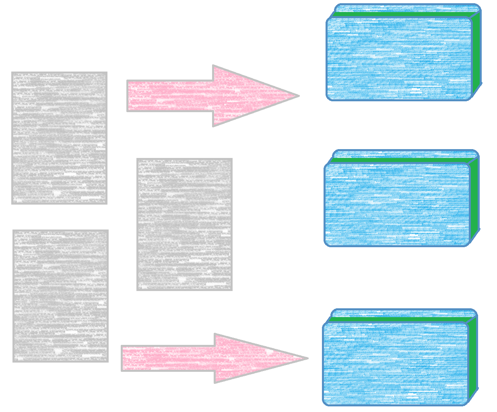
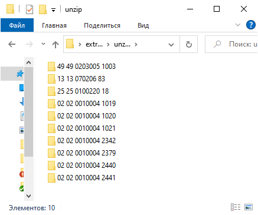
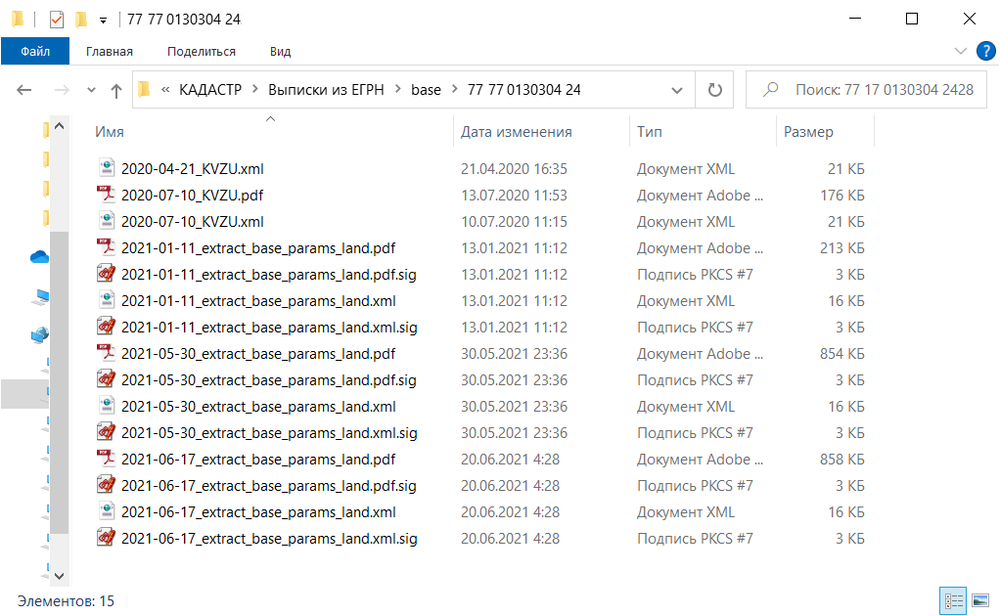
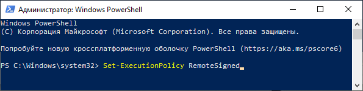
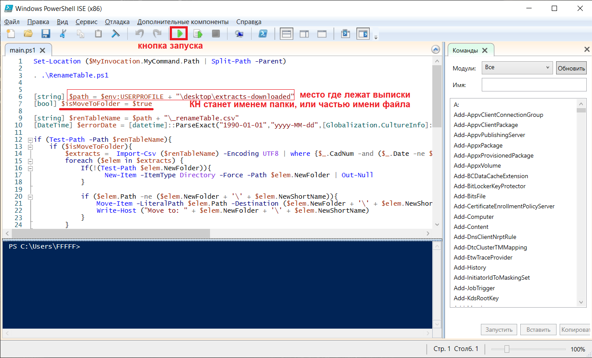
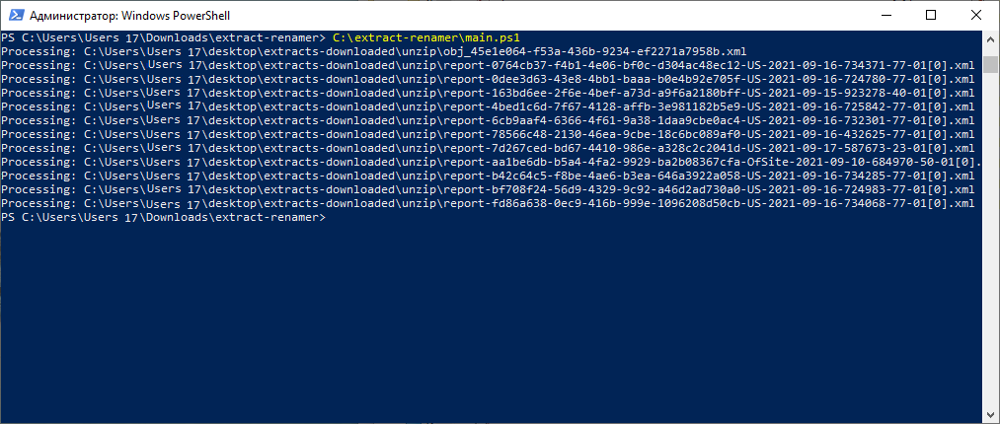
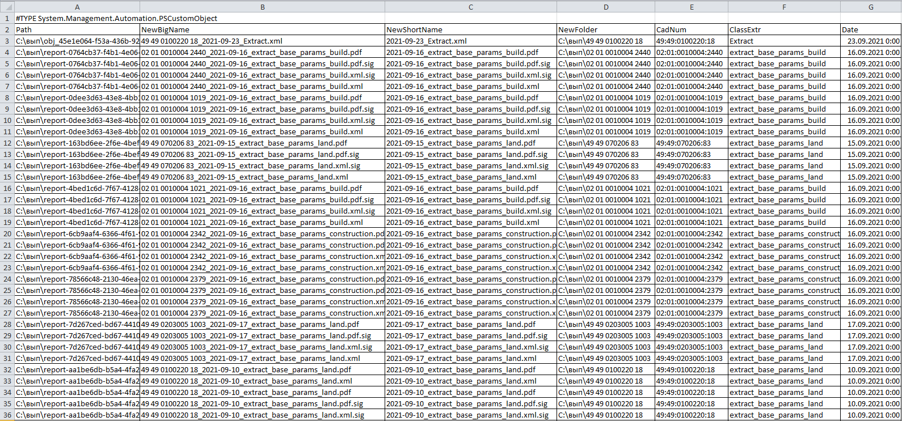
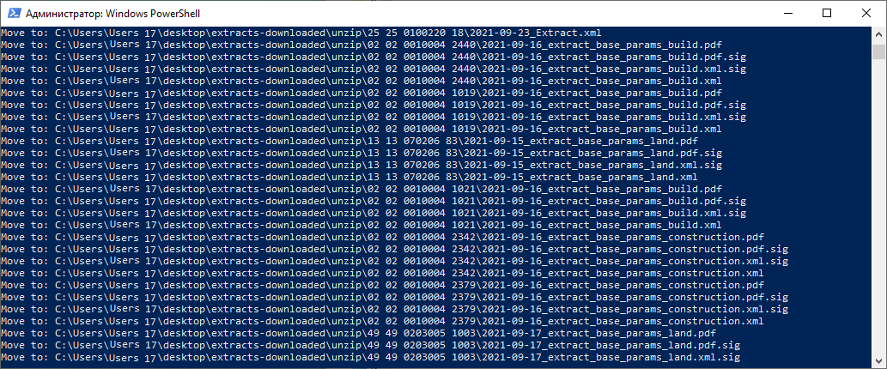

= Скрипт для наведения порядка в выписках из ЕГРН
2021-09-24

____
Порядок — сила: бережет время

—  Русская пословица
____

[[_назначение]]
== Назначение

Выписки из Единого государственного реестра недвижимости (ЕГРН), которые
генерирует Росреестр, имеют нечитаемые наименования файлов.

image:doc/img/extract_before.png[Распакованные выписки]

Extract-renamer — это скрипт, написанный на языке PowerShell и
предназначенный для наведения порядка в выписках из ЕГРН.

В папочке, названной по кадастровому номеру объекта, выписки будут
рассортированы по дате и типу.

[[скачать_скрипт]]
== Загрузка на компьютер

Существует несколько способов загрузки:

* Если на компьютере установлена система контроля версий
https://www.mercurial-scm.org/downloads[Mercurial] (_Предпочтительно_):
[arabic]
. Запустите командную строку и перейдите в каталог, в котором
планируется разместить скрипт;
. Выполните команду:
+
[source,shell]
----
hg clone http://hg.code.sf.net/p/cadaster-utils/extract-renamer extract-renamer
----
* Если на компьютере установлена система контроля версий
https://git-scm.com/download/win[Git]:
[arabic]
. Запустите командную строку и перейдите в каталог, в котором
планируется разместить скрипт;
. Выполните команду:
+
[source,shell]
----
git clone --depth 1 https://github.com/gmaFFFFF/extract-renamer extract-renamer
----
* Если систем контроля версий нет, то скачайте файл по
https://github.com/gmaFFFFF/extract-renamer/archive/refs/heads/develop.zip[ссылке]
и распакуйте его в нужный каталог.

[[_установка_и_настройка_windows]]
== Установка и настройка (Windows)

[[_установка_windows_powershell]]
=== Установка Windows PowerShell

Установите на рабочем компьютере Windows PowerShell версии не менее
5.0footnote:[В Windows 10 минимально необходимая версия доступна «из
коробки»].

Ссылки на установочные пакеты в зависимости от версии операционной
системы и архитектуры доступны на
https://docs.microsoft.com/ru-ru/powershell/scripting/windows-powershell/wmf/setup/install-configure?view=powershell-7.1#download-and-install-the-wmf-51-package[сайте]
microsoft.

[[_настройка_безопасности_выполнения_скриптов_windows_powershell]]
=== Настройка безопасности выполнения скриптов Windows PowerShell

По умолчанию на клиентских компьютерах Windows запрещено выполнение
сценариев Windows PowerShell, подробности смотрите в документации
https://docs.microsoft.com/ru-ru/powershell/module/microsoft.powershell.core/about/about_execution_policies?view=powershell-7.1[о
политике выполнения PowerShell].

Разрешить выполнение нашего скрипт можно изменив политику
«ExecutionPolicy» на RemoteSignedfootnote:[Предпочтительно] или
Unrestricted.

Для этого запустите (например, из меню Пуск) Windows PowerShell или
Windows PowerShell ISE от имени администратора (нажмите по ярлыку
btn:[ПКМ], а затем "Запуск от имени администратора") и выполните
команду:

[source,powershell]
----
Set-ExecutionPolicy RemoteSigned
----

Подтвердите PowerShell свое намерение во всплывающем диалоговом окне.

image:doc/img/Set-ExecutionPolicy_confirm.png[Подтверждение изменения
политики]

Если впоследствии возникнут проблемы с политикой безопасности измените
её на Unrestricted:

[source,powershell]
----
Set-ExecutionPolicy Unrestricted
----

[[_инструкция_по_использованию]]
== Инструкция по использованию

[arabic]
. Распакуйте выписки из ЕГРН в папку на рабочем компьютере. Если Вы не
хотите менять скрипт, то эта папка должна находится на рабочем столе и
называться «extracts-downloaded».
. Если распакованные выписки в своём названии и расширении, содержат
слово .original (ох уж этот Росреестр 😬), то перед запуском скрипта
.original нужно будет убрать. Для автоматического удаления слова
.original воспользуйтесь сторонними утилитами, например,
https://www.bulkrenameutility.co.uk/Download.php[BulkRenameUtility].
. Запустите Windows PowerShell ISE и откройте в нём файл main.ps1.
+

[loweralpha]
.. Если Вы положили выписки *не* в папку «extracts-downloaded» на
рабочем столе, то замените
+
....
$env:USERPROFILE + "\desktop\extracts-downloaded"
....
+
на полный путь к Вашей папке, например,
+
....
"C:\МоиВыписки"
....
.. По умолчанию скрипт будет раскладывать выписки в папку с кадастровым
номером объекта, а из файлов, составляющих выписку, кадастровый номер
будет удалён. Если Вы хотите чтобы выписки не перемещялись во вложенную
папку, а названия файлов включали кадастровый номер, тогда замените
+
....
[bool] $isMoveToFolder = $true
....
+
на
+
....
[bool] $isMoveToFolder = $false
....
.. Ещё большей гибкости в переименовании файлов можно достичь,
редактируя файл _renameTable.csv (подробности смотрите дальше).
. Запустите выполнение скрипта с помощью зелёной стрелочки.
[loweralpha]
.. Скрипт прочтёт содержимое всех xml файлов
+

.. Создаст в папке с выписками файл _renameTable.csv
+

.. Изучите содержимое файла _renameTable.csv, именно согласно ему будут
переименовываться выписки.
+
Path::
  Полный путь к одному из файлов, составляющих выписку
NewBigName::
  Предлагаемое имя файла, включающее кадастровый номер объекта.
  Используется, если
  +
....
$isMoveToFolder = $false.
....
NewShortName::
  Предлагаемое имя файла, не включающее кадастровый номер объекта.
  Используется, если
  +
....
$isMoveToFolder = $true
....
NewFolder::
  Предлагаемый путь к папке, в которую необходимо поместить файл с
  именем *NewShortName*. Используется, если
  +
....
$isMoveToFolder = $true
....
CadNum::
  Распознанный кадастровый номер объекта недвижимости
ClassExtr::
  Распознанный тип выписки из ЕГРН
Date::
  Распознная дата выписки. Если распознать не удалось, то будет
  содержать 1 января 1990 г.
.. При необходимости отредактируйте файл _renameTable.csv (столбцы
NewBigName, NewShortName, NewFolder), используя формулы Excel, для
настройки стратегии переименования «под себя».
. Повторно запустите выполнение скрипта с помощью зелёной стрелочки.
[loweralpha]
.. Выписки будут разложены по папочкам согласно инструкции, содержащейся
в файле _renameTable.csv
+

.. Файл _renameTable.csv будет удалён.
.. Выписки, которые скрипту не удалось распознать останутся «валяться»
там же где и валялись.

[[_связанные_проекты]]
== Связанные проекты

[arabic]
. https://github.com/gmaFFFFF/extract-order[Бот] для заказа выписок из
ЕГРН.
. https://github.com/gmaFFFFF/extract-converter[Конвертер] выписок из
ЕГРН в формат Esri Shape и sql insert.
. https://plan-kpt-xml2html.sourceforge.io/plan-kpt-xml2html.xhtml[Онлайн]
конвертер xml схем расположения земельного участка или земельных
участков на кадастровом плане территории в человекочитаемый вид.
. https://github.com/gmaFFFFF/land-management-contracts[Шаблоны]
договоров и технических заданий по землеустройству в формате AsciiDoc.
. https://github.com/gmaFFFFF/realty-db-in-excel[База данных]
недвижимости в Excel.
. https://github.com/gmaFFFFF/cadaster-parcel-descr-dwg[Описание
земельного участка] — программа подготовки графической части описания
земельного участка для выполнения кадастровых работ (устарело).
. https://github.com/gmaFFFFF/shubich-vo-imja-zhizni/releases[«Во имя
жизни»] (автобиографическая повесть) проф. землеустройства М.П. Шубича.

[[_условия_распространения_скрипта]]
== Условия распространения скрипта

Скрипт распространяется под открытой лицензией MIT.

Если кратко, то это означает, что Вы можете пользоваться им, улучшать
его и, если сможете, то даже продавать его. При этом автор не несёт ни
за что никакой ответственности, всё на Ваш страх и риск. Условия
лицензии содержатся в файле license.txt, расположенном в корневом
каталоге.

Популярное объяснение условий лицензии можно почитать
https://habr.com/ru/post/310976/[здесь].
